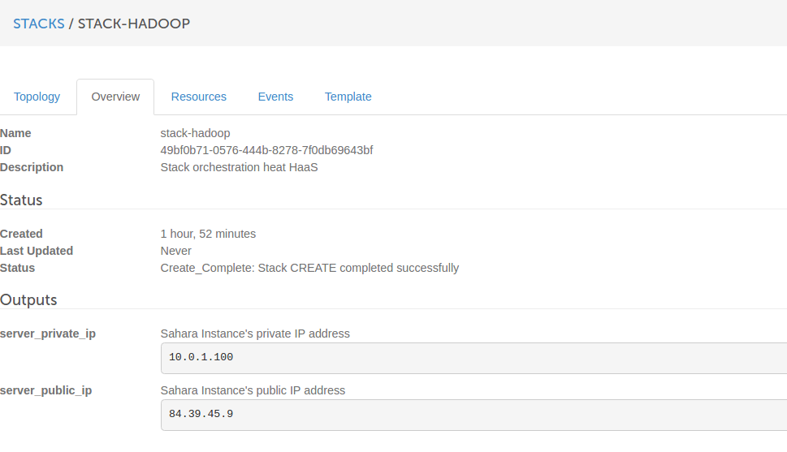
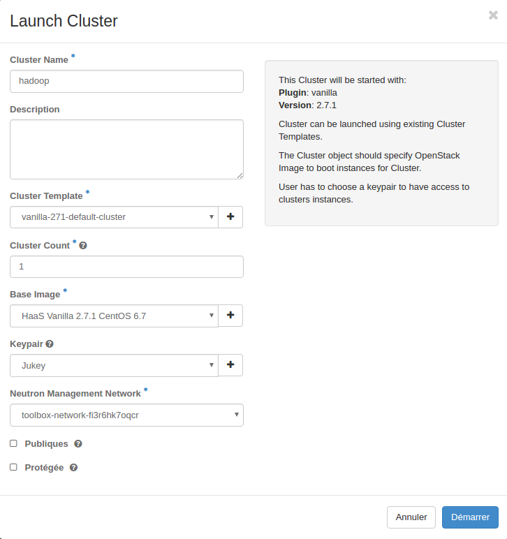
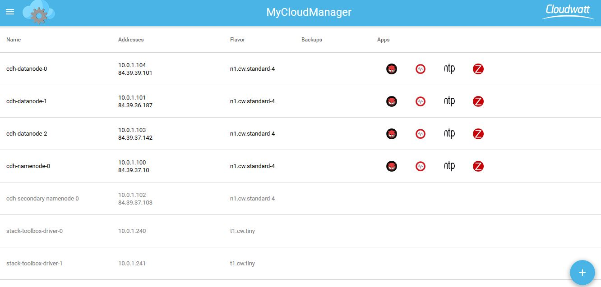
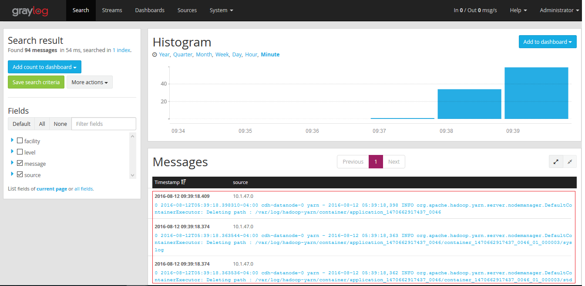

# Instrumentaliser un cluster Hadoop avec MyCloudManager

 

## Lancement des Stacks

Ce tutoriel à pour but de vous montrer comment Instrumentaliser votre cluster hadoop avec la stack MyCloudManager.

Pour commencer assurez vous d'avoir lancé les stacks dans votre tenant, si ce n'est pas le cas, je vous invite à regarder les articles suivant :

* Demarrer MyCloudManager : http://dev.cloudwatt.com/fr/blog/innovation-beta-mycloudmanager-v2.html

* Demarrer un cluster Hadoop : http://dev.cloudwatt.com/fr/blog/deployer-votre-service-hadoop-as-a-service-au-travers-d-un-stack-heat.html

## Demarrer l'instrumentalisation

Pour pouvoir déployer les applications MyCloudManager, il faut que celui-ci puisse communiquer avec les instances et donc que celle-ci soit attachées au même réseau que votre stack MyCloudManager.

Dans le cadre du déploiement du cluster hadoop, il nous ai possible de choisir le réseau sur lequel celui-ci sera déployé. Voici la procédure :

* Connectez vous à l'interface web de votre stack hadoop via la flotting-ip donné en sortie de votre stack ainsi que vos indentifiants Cloudwatt,

* Vérifier que vous vous trouvez bien sur le tenant où vous avez crée MyCloudManager ainsi que la region, dans cet exemple : tenant = `0750177966_@_1449053663`, region= `FR1`

* Commencer la création de votre cluster, rendez-vous dans la partie `Data Processing` puis `Clusters` de votre console Hadoop puis cliquez sur `Launch Cluster`, choisissez à présent le type de cluster ainsi que la version, dans cet exemple : plugin `Vanilla` version 2.7.1

* Sur le deuxième volet renseignez les paramètres que vous souhaitez donner à votre cluster, et surtout dans la partie `Neutron Management Network` renseignez ici le réseau de votre MyCloudManager puis démarrez la création,

* Une fois votre cluster créé vous pouvez maintenant vous connecter en *ssh* sur l'ensemble des instances qui le compose et copier la commande `curl` qui vous est donnée lors de l'ajout d'une instance dans MyCloudManager,

* Apres avoir attaché les instances, vous pouvez à présent lancer le déployement des applications comme expliqué dans l'article MyCloudManager,

  http://dev.cloudwatt.com/fr/blog/innovation-beta-mycloudmanager-v2.html

* Cliquer sur les icônes situant à droite de chaque instance afin d'installer les services correspondantes comme Zabbix, Ntp, GrayLog ... Si l'application n'est pas bien installée sur les nœuds, pensez à copier le contenu du fichier ~/.ssh/authorized_keys2 à ~/.ssh/authorized_keys et réinstallez-la.

* Les instances sont maintenant bien monitorées par le MyCloudManager.

## Monitoring des métriques des nœuds par Zabbix

Zabbix est bien configurés sur le nœuds sans avoir besoins de modifications. Les métriques des nœuds telles la charge de CPU, l'utlisation de CPU, l'utilisation des disques ... sont visibles sur son interface.

## Monitoring des logs des noueds par Log Management (Graylog)

L'application Log Management (Graylog) est configurée pour monitorer les logs de syslogs des noeuds en utilisant des agents rsyslog. Par contre, les noeuds de cluster Hadoop ont d'autres logs à gérer à part les logs de syslogs comme les logs de Datanodes, les logs de Namenode, les logs de Yarn, ... Afin de surveiller proprement les logs d'un cluster Hadoop, nous avons besoin d'ajouter ces logs aux configurations rsyslog pour qu'il puisse les monter dans Graylog.

* Se connecter aux noeuds avec les droits root de votre user
* Vérifier la version de rsyslog

~~~bash
rsyslog -version
~~~

* Mettre à jour la version de rsyslog si elle est inférieure à 8.15.0

~~~bash
wget http://rpms.adiscon.com/v8-stable/rsyslog.repo -O /etc/yum.repos.d/rsyslog.repo
yum update rsyslog
/etc/init.d/rsyslogd restart
~~~

* Modifier la configuration de rsyslog: Les fichiers .conf de rsyslog se trouvent dans /etc/rsyslog.d/. Pour chaque log de hadoop à surveiller, nous ajoutons un fichier .conf en précisant le chemin de logs. Ci-dessous est un exemple de configuration pour les logs de yarn

~~~bash
module(load="imfile" mode="inotify")
$InputFileName /var/log/hadoop-yarn/hadoop-*.out
$InputFileTag yarn:
$InputRunFileMonitor
~~~

* Visualiser les logs via l'interface de Graylog

---
Have Fun and Hack in Peace
