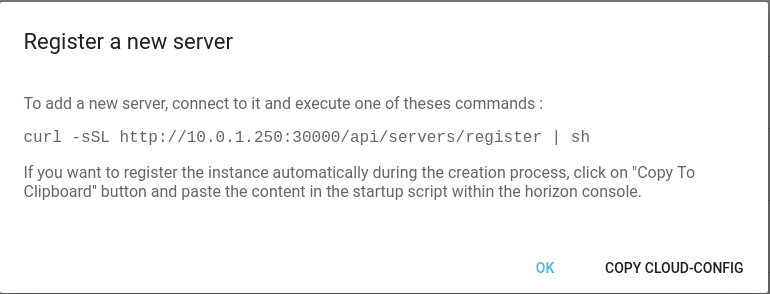
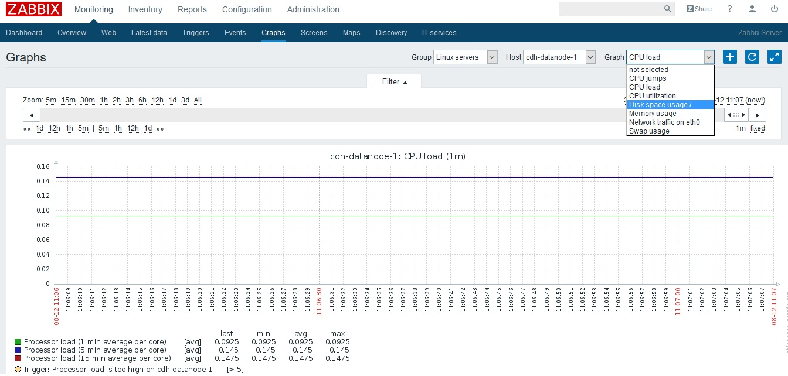

# Instrumentalize Hadoop cluster with MyCloudManager

 

## Launch Stacks

This tutorial will show you how your Instrumentalize hadoop cluster with MyCloudManager stack.

To start make sure you have launched the stacks in your tenant, if this is not the case, I invite you to watch the following items:

* Start MyCloudManager : http://dev.cloudwatt.com/en/blog/innovation-beta-mycloudmanager-v2.html

* Start Hadoop cluster : http://dev.cloudwatt.com/en/blog/deployer-votre-service-hadoop-as-a-service-au-travers-d-un-stack-heat.html

## Start the instrumentalization

To deploy MyCloudManager's applications, it is necessary that MyCloudManager can communicate with your instances. You must attach them to the network of your MyCloudManager.

Concerning the hadoop cluster deployment, you can choose the network on which it will be deployed. Here's how:

* Connect to the web interface of your stack hadoop via flotting-ip given output of your stack and your Cloudwatt's credentials,

* Check that you are well on the tenant and the region where you created MyCloudManager, in this example: tenant = `0750177966_@_1449053663`, region= `FR1`.

* Start building your cluster, go to the `Data Processing` then `Clusters` part of your Hadoop console and click `Launch Cluster`, choose now the cluster type and version, in this example: plugin `Vanilla` version 2.7.1

* On the second screen enter the parameters you want your cluster, and especially in the part `Neutron Management Network` enter here the network of your MyCloudManager then start creating,

* Once your cluster you created can now log in *ssh* on all instances and copy the `curl` command given to you when adding an instance in MyCloudManager,

* After attached instances, you can now start the deployement applications as explained in the article MyCloudManager,

  http://dev.cloudwatt.com/en/blog/innovation-beta-mycloudmanager-v2.html

* Click on the icons located to the right of each instance to install the corresponding services like Zabbix, Ntp, GrayLog ... If the application is not properly installed on the nodes, consider copying the file content ~ /. ssh / authorized_keys2 to ~ / .ssh / authorized_keys and reinstall it.

* Instances are now well monitored by MyCloudManager.

## Monitoring metrics nodes by Zabbix

Zabbix is configured on the nodes without modifications needs. The metrics of the nodes such as CPU load, utlisation CPU, disk usage ... are visible on the interface.

## Monitoring logs nodes by Log Management (Graylog)

The Log Management (Graylog) is configured to monitor syslogs logs nodes using rsyslog agents. However the cluster nodes Hadoop have other logs to manage separately as DataNodes logs, NameNode logs, Yarn logs, ... In order to properly monitor the logs of a Hadoop cluster, we need to add these logs with rsyslog configurations to mount them in Graylog.

* Connect the nodes to the root of your user
* Check the rsyslog version

~~~bash
rsyslog -version
~~~

* Update the version of rsyslog if it is less than 8.15.0

~~~bash
wget http://rpms.adiscon.com/v8-stable/rsyslog.repo -O /etc/yum.repos.d/rsyslog.repo
yum update rsyslog
/etc/init.d/rsyslogd restart
~~~

* Change the syslog configuration: The .conf file rsyslog are in /etc/rsyslog.d/. For each hadoop log to watch, we add a .conf file and specifying the log path. Below is a sample configuration for Yarn logs.

~~~bash
module(load="imfile" mode="inotify")
$InputFileName /var/log/hadoop-yarn/hadoop-*.out
$InputFileTag yarn:
$InputRunFileMonitor
~~~

* View the logs via Graylog interface

---
Have Fun and Hack in Peace
